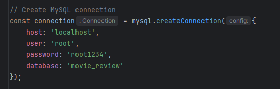

<h1 align="center">Movie Review Web Application</h1>


<p align="center">
  A comprehensive web application that allows users to view and explore a vast collection of movies, built using Node.js, Express, and MySQL.
</p>

## 🚀 Key Features

- **Movie Listings**: Display a comprehensive list of movies with detailed information, including title, director, release year, genre, and description.
- **Movie Poster Images**: Fetch and display movie poster images, enhancing the overall user experience.
- **About Page**: Provide a dedicated page with information about the project and its purpose.
- **Database Integration**: Seamlessly integrate with a MySQL database to store and retrieve movie data.

## 🛠️ Technical Details

- **Backend**: Node.js and Express.js for the server-side logic and API.
- **Database**: MySQL for storing and managing movie data.
- **Templating**: EJS (Embedded JavaScript) for server-side rendering of views.
- **Styling**: Use of CSS for styling the user interface.

## 🔧 Installation and Setup

### Step 1. Clone the repository:

   ```bash
   git clone https://github.com/your-username/movie-review-app.git
   ```

### Step 2: Navigate to the Project Directory
activate your mysql server. please note, you will probably need to change the host, user, password, or database in the app.js 
 
```bash
mysql -u root -p
```

### Step 3: Load the database into your mysql
This will populate the database tables with the initial data from the seed.sql file.
Make sure to replace [your_mysql_username] with your actual MySQL username. You may also be prompted to enter your MySQL password during the process.
```

mysql -u [your_mysql_username] -p < schema.sql
mysql -u [your_mysql_username] -p < seed.sql
```

### Step 4: Install dependencies
```angular2html
npm install
```

### Step 4: Run the program
```angular2html
node app.js
```

### Step 5: Troubleshooting / please DM or email me to get to setup. I am confident this code works.
```
I am confident that the backend and sql works. Please email me at vmc43b@umsystem.edu or DM on discord @vinny_zip to help with setup
```
